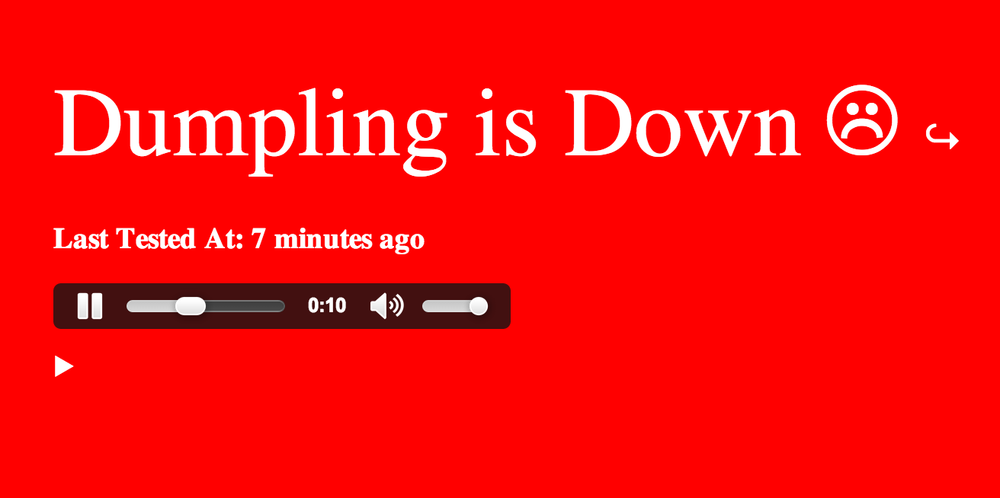

status_cake_alarm
=================

An alarm to attract your attention when your web server goes down. Currently fetches status using [StatusCake](https://www.statuscake.com/).

# Setting up

* Copy `config/conf.yml.example` to `config/conf.yml`
* Add config values
* `./alarm.rb`
